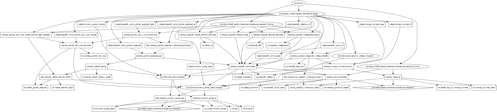

# Azure Database for MariaDB Terraform Module

Azure Database for MariaDB is a relational database service based on the open-source MariaDB Server engine. It's a fully managed database as a service offering that can handle mission-critical workloads with predictable performance and dynamic scalability.

## Resources supported

* [MariaDB Server](https://registry.terraform.io/providers/hashicorp/azurerm/latest/docs/resources/mariadb_server)
* [MariaDB Database](https://registry.terraform.io/providers/hashicorp/azurerm/latest/docs/resources/mariadb_database)
* [MariaDB Configuration](https://registry.terraform.io/providers/hashicorp/azurerm/latest/docs/resources/mariadb_configuration)
* [MariaDB Firewall Rules](https://registry.terraform.io/providers/hashicorp/azurerm/latest/docs/resources/mysql_firewall_rule)
* [MariaDB Virtual Network Rule](https://registry.terraform.io/providers/hashicorp/azurerm/latest/docs/resources/mariadb_virtual_network_rule)
* [MySQL Diagnostics](https://docs.microsoft.com/en-us/azure/azure-sql/database/metrics-diagnostic-telemetry-logging-streaming-export-configure?tabs=azure-portal)
* [Private Endpoints](https://www.terraform.io/docs/providers/azurerm/r/private_endpoint.html)
* [Private DNS zone for `privatelink` A records](https://www.terraform.io/docs/providers/azurerm/r/private_dns_zone.html)

## Module Usage

```hcl
module "mariadb" {
  source  = "kumarvna/mariadb-server/azurerm"
  version = "1.0.0"

  # By default, this module will create a resource group
  # proivde a name to use an existing resource group and set the argument 
  # to `create_resource_group = false` if you want to existing resoruce group. 
  # If you use existing resrouce group location will be the same as existing RG.
  create_resource_group = false
  resource_group_name   = "rg-shared-westeurope-01"
  location              = "westeurope"

  # MariaDB Server and Database settings
  mariadb_server_name = "mariadbsqlsrv01"

  mariadb_settings = {
    sku_name   = "GP_Gen5_16"
    storage_mb = 5120
    version    = "10.2"
    # default admin user `sqladmin` and can be specified as per the choice here
    # by default random password created by this module. required password can be specified here
    admin_username = "sqladmin"
    admin_password = "H@Sh1CoR3!"
    # Database name, charset and collection arguments  
    database_name = "demomariadb01"
    charset       = "utf8"
    collation     = "utf8_unicode_ci"
    # Storage Profile and other optional arguments
    auto_grow_enabled             = true
    backup_retention_days         = 7
    geo_redundant_backup_enabled  = false
    public_network_access_enabled = true
    ssl_enforcement_enabled       = true
  }

  # Sets a MariaDB Configuration value on a MariaDB Server.
  # For more information: https://mariadb.com/kb/en/server-system-variables/
  mariadb_configuration = {
    interactive_timeout = "600"
  }

  # Use Virtual Network service endpoints and rules for Azure Database for MariaDB
  subnet_id = var.subnet_id

  # (Optional) To enable Azure Monitoring for Azure MariaDB database
  # (Optional) Specify `enable_logs_to_storage_account` to save monitoring logs to storage.
  # Create required storage account by specifying optional `storage_account_name` variable. 
  log_analytics_workspace_name   = "loganalytics-we-sharedtest2"
  enable_logs_to_storage_account = true
  storage_account_name           = "mariadblogdignostics"

  # Creating Private Endpoint requires, VNet name and address prefix to create a subnet
  # By default this will create a `privatelink.mysql.database.azure.com` DNS zone. 
  # To use existing private DNS zone specify `existing_private_dns_zone` with valid zone name
  enable_private_endpoint       = true
  virtual_network_name          = "vnet-shared-hub-westeurope-001"
  private_subnet_address_prefix = ["10.1.5.0/29"]
  #  existing_private_dns_zone     = "demo.example.com"

  # Firewall Rules to allow azure and external clients and specific Ip address/ranges. 
  firewall_rules = {
    access-to-azure = {
      start_ip_address = "0.0.0.0"
      end_ip_address   = "0.0.0.0"
    },
    desktop-ip = {
      start_ip_address = "49.204.228.223"
      end_ip_address   = "49.204.228.223"
    }
  }

  # Tags for Azure Resources
  tags = {
    Terraform   = "true"
    Environment = "dev"
    Owner       = "test-user"
  }
}
```

## Default Local Administrator and the Password

This module utilizes __`sqladmin`__ as a local administrator on MariaDB server. If you want to you use custom username, then specify the same by setting up the argument `admin_username` with a valid user string.

By default, this module generates a strong password for MySQL server also allows you to change the length of the random password (currently 24) using the `random_password_length` variable. If you want to set the custom password, specify the argument `admin_password` with a valid string.

## **`mariadb_settings`** - Setting up your MariaDB Server

This object helps you setup desired MariaDB server and support following arguments.

| Argument | Description |
|--|--|
`sku_name`|Specifies the SKU Name for this MariaDB Server. The name of the SKU, follows the tier + family + cores pattern (e.g. `B_Gen4_1`, `GP_Gen5_8`). Valid values are `B_Gen5_1`, `B_Gen5_2`, `GP_Gen5_2`,`GP_Gen5_4`, `GP_Gen5_8`, `GP_Gen5_16`, `GP_Gen5_32`, `MO_Gen5_2`, `MO_Gen5_4`, `MO_Gen5_8`, and `MO_Gen5_16`.
`version`|Specifies the version of MariaDB to use. Possible values are `10.2` and `10.3`.
`storage_mb`|Max storage allowed for a server. Possible values are between `5120` MB (5GB) and `1024000MB` (1TB) for the Basic SKU and between `5120` MB (5GB) and `4096000` MB (4TB) for General Purpose/Memory Optimized SKUs.
`auto_grow_enabled`|Enable/Disable auto-growing of the storage. Storage auto-grow prevents your server from running out of storage and becoming read-only. If storage auto grow is enabled, the storage automatically grows without impacting the workload. The default value if not explicitly specified is `true`.
`backup_retention_days`|Backup retention days for the server, supported values are between `7` and `35` days.
`create_mode`|The creation mode. Can be used to restore or replicate existing servers. Possible values are `Default`, `Replica`, `GeoRestore`, and `PointInTimeRestore`. Defaults to `Default`.
`creation_source_server_id`|For creation modes other than `Default`, the source server ID to use.
`restore_point_in_time`|When `create_mode` is `PointInTimeRestore`, specifies the point in time to restore from `creation_source_server_id`.
`geo_redundant_backup_enabled`|Turn Geo-redundant server backups on/off. This allows you to choose between locally redundant or geo-redundant backup storage in the General Purpose and Memory Optimized tiers. When the backups are stored in geo-redundant backup storage, they are not only stored within the region in which your server is hosted, but are also replicated to a paired data center. This provides better protection and ability to restore your server in a different region in the event of a disaster. This is not supported for the Basic tier.
`public_network_access_enabled`|Whether or not public network access is allowed for this server. Defaults to `true`.
`ssl_enforcement_enabled`|Specifies if SSL should be enforced on connections. Possible values are `true` and `false`.

## Advanced Usage of the Module

### **`mariadb_configuration`** - Configure MariaDB Server Parameters

The MariaDB engine provides many different server variables/parameters that can be used to configure and tune engine behavior. Some parameters can be set dynamically during runtime while others are "static", requiring a server restart in order to apply.

The list of supported server parameters is constantly growing. Use the server parameters tab in the Azure portal to view the full list and configure server parameters values. Specifies the name of the MariaDB Configuration, [which needs to be a valid MariaDB configuration name](https://mariadb.com/kb/en/server-system-variables/). A few Supported parameters are here for your reference. 

| Parameter name | Description | Parameter Type |Default Value
|--|--|--|--|
`character_set_client`|Determines the character set for queries arriving from the client. It can be set per session by the client, although the server can be configured to ignore client requests with the --skip-character-set-client-handshake option. If the client does not request a character set, or requests a character set that the server does not support, the global value will be used. `utf16`, `utf32` and `ucs2` cannot be used as client character sets.|Dynamic|`utf8`
`character_set_database`| Character set used by the default database, and set by the server whenever the default database is changed. If there's no default database, `character_set_database` contains the same value as `character_set_server`. This variable is dynamic, but should not be set manually, only by the server.|Dynamic|`latin1`
`connect_timeout`|Time in seconds that the server waits for a connect packet before returning a 'Bad handshake'. Increasing may help if clients regularly encounter 'Lost connection to MariaDB server at 'X', system error: error_number' type-errors.|Static|`10`
`encryption_algorithm`| Which encryption algorithm to use for table encryption. aes_cbc is the recommended one. See [Table and Tablespace Encryption](https://mariadb.com/kb/en/table-and-tablespace-encryption/). Valid Values: `none`, `aes_ecb`, `aes_cbc`, `aes_ctr`|Static|`none`

### MariaDB Virtual Network Rule

Virtual network rule: A virtual network rule for your Azure Database for MariaDB server is a subnet that is listed in the access control list (ACL) of your Azure Database for MariaDB server. To be in the ACL for your Azure Database for MariaDB server, the subnet must contain the `Microsoft.Sql` type name.

> This feature is available in all regions of Azure where Azure Database for MariaDB is deployed for General Purpose and Memory Optimized servers.

### Server Firewall Rules

Firewalls prevent all access to your database server until you specify which computers have permission. To configure a firewall, create firewall rules that specify ranges of acceptable IP addresses.

By default, no external access to your MariaDB Database will be allowed until you explicitly assign permission by creating a firewall rule. To add the firewall rules to the MariaDB database, specify the list of `firewall_rules` with valid IP addresses.

### Private Link to Azure Database for MariaDB

Azure Private Endpoint is a network interface that connects you privately and securely to a service powered by Azure Private Link. Private Endpoint uses a private IP address from your VNet, effectively bringing the service into your VNet.

With Private Link, Microsoft offering the ability to associate a logical server to a specific private IP address (also known as private endpoint) within the VNet. Clients can connect to the Private endpoint from the same VNet, peered VNet in same region, or via VNet-to-VNet connection across regions. Additionally, clients can connect from on-premises using ExpressRoute, private peering, or VPN tunneling.

By default, this feature not enabled on this module. To create private link with private endpoints set the variable `enable_private_endpoint` to `true` and provide `virtual_network_name`, `private_subnet_address_prefix` with a valid values. You can also use the existing private DNS zone to create DNS records. To use this feature, set the `existing_private_dns_zone` with a valid existing private DNS zone name.

For more details: [Private Link for Azure Database for MariaDB](https://docs.microsoft.com/en-us/azure/mariadb/concepts-data-access-security-private-link)

>The private link feature is only available for Azure Database for MariaDB servers in the General Purpose or Memory Optimized pricing tiers. Ensure the database server is in one of these pricing tiers.

## Recommended naming and tagging conventions

Applying tags to your Azure resources, resource groups, and subscriptions to logically organize them into a taxonomy. Each tag consists of a name and a value pair. For example, you can apply the name `Environment` and the value `Production` to all the resources in production.
For recommendations on how to implement a tagging strategy, see Resource naming and tagging decision guide.

>**Important** :
Tag names are case-insensitive for operations. A tag with a tag name, regardless of the casing, is updated or retrieved. However, the resource provider might keep the casing you provide for the tag name. You'll see that casing in cost reports. **Tag values are case-sensitive.**

An effective naming convention assembles resource names by using important resource information as parts of a resource's name. For example, using these [recommended naming conventions](https://docs.microsoft.com/en-us/azure/cloud-adoption-framework/ready/azure-best-practices/naming-and-tagging#example-names), a public IP resource for a production SharePoint workload is named like this: `pip-sharepoint-prod-westus-001`.

## Requirements

| Name | Version |
|------|---------|
| terraform | >= 0.13 |
| azurerm | >= 2.59.0 |

## Providers

| Name | Version |
|------|---------|
| azurerm | >= 2.59.0 |
| random |>= 3.1.0 |

## Inputs

| Name | Description | Type | Default |
|--|--|--|--|
`create_resource_group` | Whether to create resource group and use it for all networking resources | string | `"false"`
`resource_group_name` | The name of the resource group in which resources are created | string | `""`
`location` | The location of the resource group in which resources are created | string | `""`
`log_analytics_workspace_name`|The name of log analytics workspace name|string|`null`
`random_password_length`|The desired length of random password created by this module|string|`24`
`subnet_id`|The resource ID of the subnet|string|`null`
`mariadb_server_name`|MariaDB server Name|string|`""`
`admin_username`|The username of the local administrator used for the SQL Server|string|`"sqladmin"`
`admin_password`|The Password which should be used for the local-administrator on this SQL Server|string|`null`
`mariadb_settings`|MariaDB server settings|object({})|`{}`
`create_mode`|The creation mode. Can be used to restore or replicate existing servers. Possible values are `Default`, `Replica`, `GeoRestore`, and `PointInTimeRestore`|string|`Default`
`creation_source_server_id`|For creation modes other than `Default`, the source server ID to use|string|`null`
`restore_point_in_time`|When `create_mode` is `PointInTimeRestore`, specifies the point in time to restore from `creation_source_server_id`|string|`null`
`storage_account_name`|The name of the storage account name|string|`null`
`mariadb_configuration`|Sets a MariaDB Configuration value on a MariaDB Server|map(string)|`{}`
`firewall_rules`|Range of IP addresses to allow firewall connections|map(object({}))|`null`
`enable_logs_to_storage_account`|Create a storage account where logs should be sent|string|`false`
`enable_private_endpoint`|Azure Private Endpoint is a network interface that connects you privately and securely to a service powered by Azure Private Link|string|`"false"`
`virtual_network_name` | The name of the virtual network|string|`""`
`private_subnet_address_prefix`|A list of subnets address prefixes inside virtual network| list |`[]`
`existing_private_dns_zone`|Name of the existing private DNS zone|string|`null`
`Tags` | A map of tags to add to all resources | map | `{}`

## Outputs

| Name | Description |
|--|--|
`resource_group_name`|The name of the resource group in which resources are created
`resource_group_location`|The location of the resource group in which resources are created
`storage_account_id`|The ID of the storage account
`storage_account_name`|The name of the storage account
`mariadb_server_id`|The resource ID of the MariaDB Server
`mariadb_server_fqdn`|The FQDN of the MariaDB Server
`mariadb_database_id`|The resource ID of the MariaDB Database
`mariadb_server_private_endpoint`|id of the MariaDB server Private Endpoint
`mariadb_server_private_dns_zone_domain`|DNS zone name of MariaDB server Private endpoints dns name records
`mariadb_server_private_endpoint_ip`|MariaDB server private endpoint IPv4 Addresses
`mariadb_server_private_endpoint_fqdn`|MariaDB server private endpoint FQDN Addresses

## Resource Graph



## Authors

Originally created by [Kumaraswamy Vithanala](mailto:kumarvna@gmail.com)

## Other resources

* [Azure database for MariaDB](https://docs.microsoft.com/en-us/azure/mariadb/)
* [Terraform AzureRM Provider Documentation](https://www.terraform.io/docs/providers/azurerm/index.html)
